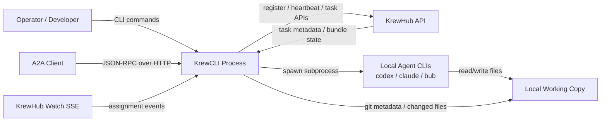
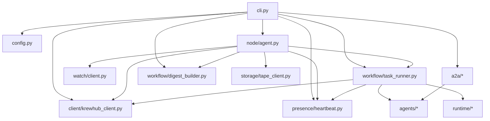

# KrewCLI Architecture

## Scope

This document scopes the current architecture of `anvztor/krewcli` as it exists on the `main` branch.

The repository is a local Python CLI service that:

- exposes a local A2A agent server,
- registers and reports presence to KrewHub,
- claims or receives task assignments from KrewHub,
- runs a local coding agent CLI such as Codex, Claude, or Bub,
- reports milestones, task status, and bundle digests back to KrewHub.

The architecture currently has three user-visible entry surfaces:

- `krewcli start`: long-running local agent server,
- `krewcli claim` and related commands: direct task operations,
- A2A HTTP endpoint: external agent-to-agent execution surface.

## System Context



## Internal Containers



## Main Subsystems

### 1. CLI and process bootstrap

Primary file:

- `src/krewcli/cli.py`

Responsibilities:

- parse Click commands,
- load environment-backed settings,
- construct the KrewHub API client,
- choose execution mode: `poll` or `watch`,
- start the local A2A server,
- provide direct operational commands such as `list-tasks`, `claim`, `milestone`, and `status`.

### 2. Agent backend abstraction

Primary files:

- `src/krewcli/agents/base.py`
- `src/krewcli/agents/registry.py`
- `src/krewcli/agents/codex_agent.py`
- `src/krewcli/agents/claude_agent.py`
- `src/krewcli/agents/bub_agent.py`

Responsibilities:

- define the common runner contract,
- wrap local CLI tools behind a uniform interface,
- execute agent subprocesses,
- collect modified file paths and repository metadata,
- normalize backend output into `TaskResult`.

Current backend model:

- `codex` and `bub` use a generic `LocalCliAgent`,
- `claude` has a custom streaming wrapper that parses `stream-json` output,
- all backends are selected through `AGENT_REGISTRY`.

### 3. KrewHub integration

Primary file:

- `src/krewcli/client/krewhub_client.py`

Responsibilities:

- recipe lookup,
- bundle and task lookup,
- task claim and task status updates,
- milestone event posting,
- digest submission and approval decisions,
- agent registration and heartbeat traffic.

This client is the main boundary to the external Cookrew/KrewHub service.

### 4. Presence and scheduling modes

Primary files:

- `src/krewcli/presence/heartbeat.py`
- `src/krewcli/node/agent.py`
- `src/krewcli/watch/client.py`

There are two execution modes:

- `poll` mode: a background worker loops over open tasks and claims one task at a time,
- `watch` mode: `NodeAgent` registers with KrewHub, starts heartbeats, reconciles existing assignments, and listens to the watch stream for task assignment events.

The watch mode is the more scheduler-oriented architecture. The poll mode is explicitly kept for backward compatibility.

### 5. Task execution workflow

Primary files:

- `src/krewcli/workflow/task_runner.py`
- `src/krewcli/workflow/digest_builder.py`
- `src/krewcli/agents/models.py`

Responsibilities:

- claim task,
- build agent prompt,
- execute the agent,
- post milestone evidence,
- mark task `done` or `blocked`,
- accumulate task outputs and submit a bundle digest once the bundle is cooked and all results are present.

`TaskRunner` is the operational center of the repo. Both polling and watch-driven paths converge here.

### 6. Runtime and storage abstraction seams

Primary files:

- `src/krewcli/runtime/interface.py`
- `src/krewcli/runtime/job.py`
- `src/krewcli/storage/interface.py`
- `src/krewcli/storage/tape_client.py`

These modules define future-facing seams:

- `AgentRuntimeInterface` acts like a runtime contract for backend execution,
- `JobRuntime` adapts current CLI-based agents to that contract,
- `AgentStorageInterface` and `TapeStorageClient` provide a context-loading layer for recipe tape history.

These abstractions are present, but the default execution path still largely uses the legacy registry-based agent invocation.

### 7. A2A server surface

Primary files:

- `src/krewcli/a2a/server.py`
- `src/krewcli/a2a/executor.py`
- `src/krewcli/a2a/card.py`

Responsibilities:

- publish an A2A-compatible local HTTP app,
- advertise supported agent skills through an `AgentCard`,
- route incoming A2A messages to the configured backend,
- return structured task artifacts describing task results.

This surface is independent from KrewHub scheduling, but it reuses the same local agent wrappers.

## Key Runtime Flows

### Flow A: `krewcli start --mode poll`

1. CLI loads settings and recipe context from KrewHub.
2. Heartbeat loop starts.
3. Poll worker periodically calls `list_tasks`.
4. First open task is claimed.
5. `TaskRunner` executes the selected local agent backend.
6. Milestone event and terminal task status are posted to KrewHub.
7. If the enclosing bundle is cooked and all task results are present, a digest is submitted.
8. A2A server remains available for independent requests during the same process lifetime.

### Flow B: `krewcli start --mode watch`

1. CLI constructs `NodeAgent`.
2. `NodeAgent` registers presence with KrewHub.
3. Heartbeat loop starts.
4. `NodeAgent` reconciles already-assigned open tasks.
5. `WatchClient` subscribes to KrewHub SSE events.
6. On assignment events for the local agent, `NodeAgent` triggers task execution through `TaskRunner`.
7. Successful results are collected into a digest builder and submitted when the bundle is cooked.

### Flow C: direct A2A execution

1. A remote A2A client sends a message to the local A2A app.
2. `KrewAgentExecutor` resolves the target backend from the prompt prefix or default agent.
3. The selected backend runs in the local working directory.
4. The task result is returned as an A2A artifact and status events are emitted on the A2A stream.

## Module Map

| Package | Role |
| --- | --- |
| `krewcli.cli` | top-level commands and process orchestration |
| `krewcli.config` | settings from environment |
| `krewcli.client` | outbound KrewHub HTTP client |
| `krewcli.presence` | heartbeat lifecycle |
| `krewcli.workflow` | task claim/execute/report and digest assembly |
| `krewcli.agents` | backend adapters for local coding tools |
| `krewcli.runtime` | future runtime abstraction layer |
| `krewcli.storage` | context-loading abstraction and tape client |
| `krewcli.watch` | SSE watch stream consumption |
| `krewcli.node` | scheduler-aware node agent |
| `krewcli.a2a` | local A2A server and executor surface |

## Architectural Observations

These are important when turning this into a more formal diagram:

- The repo has two parallel orchestration models: legacy polling and scheduler-driven watch mode.
- `TaskRunner` is the central shared workflow and should sit at the center of any internal architecture drawing.
- A2A execution is adjacent to, but not fully integrated with, KrewHub task orchestration.
- Runtime and storage interfaces suggest a target architecture with stronger dependency inversion than the current default path uses.
- `NodeAgent` loads tape context, but the loaded context is not yet passed into `TaskRunner` through `TaskRunSpec` in the default watch path.
- Agent wrappers collect repository metadata through `git` commands; this is operationally relevant because the workspace also contains `.jj`, so version-control assumptions should be explicit in any future evolution.

## Drawing Plan

If the goal is to produce a polished architecture diagram set for this repo, use this sequence:

1. Draw a system-context diagram.
   Include Operator, A2A Client, KrewCLI, KrewHub, local agent CLIs, and the local working copy.

2. Draw a container-level internal diagram.
   Put `cli.py` at the entry, `TaskRunner` at the center, `KrewHubClient` and `HeartbeatLoop` on the service edge, `NodeAgent` and `WatchClient` on the scheduler path, and `a2a/*` on the external protocol path.

3. Draw one sequence diagram for `poll` mode and one for `watch` mode.
   The split matters because both flows exist in code and have different control signals.

4. Mark current seams versus target seams.
   Show `runtime/*` and `storage/*` as architectural extension points, not yet the universal execution path.

5. Call out asynchronous boundaries.
   Heartbeats, watch-stream callbacks, subprocess execution, and digest submission are the main async boundaries that matter for debugging and operability.

6. Keep the first published diagram honest to the code.
   Do not collapse polling and watch mode into a single line unless the legend explicitly says they are alternative execution modes.

## Suggested Next Artifact

The next useful artifact would be `docs/architecture-sequence.md` with two Mermaid sequence diagrams:

- poll-mode task lifecycle,
- watch-mode assigned-task lifecycle.

That would complement this document and remove ambiguity about control flow.

## Repo Diagram Command

The repo now has a reproducible structure-diagram command:

```bash
krewcli repo-diagram --root . --format mermaid --max-depth 3
```

For terminal-friendly output, switch to `--format tree`.
