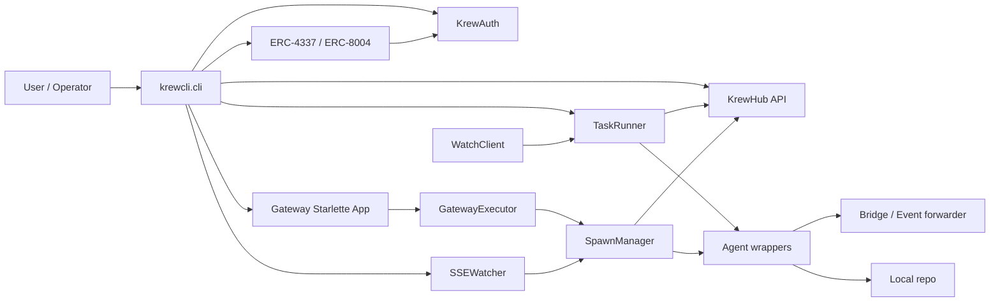
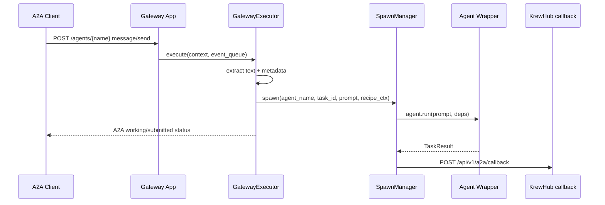
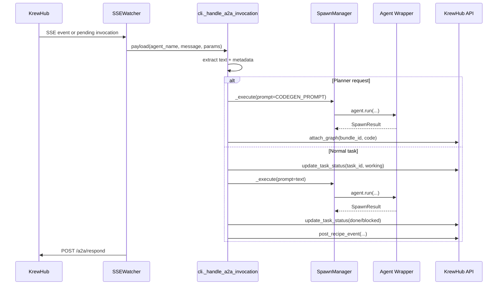

# KrewCLI Architecture

## Scope

This document traces the primary data and control flows in the current
`krewcli` codebase:

- CLI entry and command dispatch
- local A2A server dispatch
- hub-mediated SSE watching and A2A bridging
- local agent execution and event streaming
- blockchain and auth setup

The repo has more than one orchestration path. The important split is:

- direct local A2A HTTP under `/agents/{name}`
- hub-mediated A2A invocations delivered over SSE and bridged in `cli.py`
- legacy task execution via `TaskRunner` and `NodeAgent`

## Entry Points

The console entry point is defined in `pyproject.toml`:

```toml
[project.scripts]
krewcli = "krewcli.cli:main"
```

`krewcli.cli:main` is the process bootstrap. It does three things before
dispatching to a subcommand:

1. configures logging
2. loads `Settings` from environment via `get_settings()`
3. loads a stored JWT from `~/.krewcli/token` and builds `KrewHubClient`

That makes `main()` the root of almost every off-chain flow in the repo.

## Main Commands

### `join`

Primary runtime entry point.

- If legacy single-agent flags are present (`--agent`, `--provider`,
  `--framework`, `--endpoint`, `--orchestrator`), `join` resolves a
  single executor via `_resolve_mode()` and calls `_run_agent()`.
- Otherwise it enters gateway mode and calls `_run_gateway()`.
- If `--recipe` or `--cookbook` are missing, it performs interactive
  selection first.

### `onboard`

Interactive workspace bootstrap plus gateway launch.

- creates or reuses a cookbook
- clones the cookbook repo locally
- adds selected recipes as git submodules
- detects local agent CLIs
- creates the same gateway app used by `join`
- registers agents and starts heartbeats

Unlike `join`, `onboard` does not currently start the separate
`SSEWatcher` bridge for hub-delivered A2A invocations.

### `claim`

One-shot task execution path.

- loads recipe context
- starts a heartbeat
- constructs `TaskRunner`
- calls `TaskRunner.claim_and_execute(task_id)`

### `start`

Legacy alias for `join`.

### `login`, `wallet`, `session-key`

Identity and blockchain bootstrap commands.

## System Map



## Core Components

| Module | Role |
| --- | --- |
| `krewcli.cli` | top-level command dispatch and runtime wiring |
| `krewcli.client.krewhub_client` | off-chain control-plane HTTP client |
| `krewcli.presence.heartbeat` | background presence updates |
| `krewcli.a2a.gateway_server` | mounts `/agents/{name}` A2A apps |
| `krewcli.a2a.executors.gateway` | direct A2A request handler |
| `krewcli.a2a.spawn_manager` | background CLI execution and callback reporting |
| `krewcli.sse_watcher` | hub A2A poll + SSE bridge |
| `krewcli.watch.client` | legacy task watch SSE client |
| `krewcli.node.agent` | legacy watch-driven task worker |
| `krewcli.workflow.task_runner` | claim, execute, milestone, done/blocked |
| `krewcli.agents.*` | wrappers for Codex, Claude, Bub |
| `krewcli.bridge.*` | canonical hook normalization and forwarding |
| `krewcli.erc8004`, `krewcli.userop`, `krewcli.mint_agents` | on-chain identity and UserOp helpers |

## Flow 1: CLI Bootstrap And Command Dispatch

### Data flow

1. Shell runs `krewcli ...`.
2. `pyproject.toml` resolves that to `krewcli.cli:main`.
3. `main()` loads environment-backed settings from `config.py`.
4. `main()` loads JWT from `auth.token_store`.
5. `main()` constructs `KrewHubClient`.
6. Click dispatches to the selected subcommand.

### Control flow

`join` decides between two branches:

- legacy single-agent branch:
  `join()` -> `_resolve_mode()` -> `_run_agent()`
- multi-agent gateway branch:
  `join()` -> `_run_gateway()`

`claim` uses:

- `claim()` -> `TaskRunner.claim_and_execute()`

`onboard` uses:

- `onboard()` -> `_run_onboard()` -> `create_gateway_app()` -> uvicorn

## Flow 2: Direct Local A2A HTTP

This is the path for a caller that talks directly to the local gateway
over HTTP JSON-RPC.

### Server construction

`create_gateway_app()` builds one mounted A2A app per agent:

- `/agents/claude`
- `/agents/codex`
- `/agents/bub`

For each mount it creates:

1. an `AgentCard`
2. a `GatewayExecutor`
3. an A2A `DefaultRequestHandler`
4. an in-memory task store

### Request flow



### What moves through the system

Input:

- A2A JSON-RPC `message/send`
- `message.parts[].text` becomes the prompt
- `message.metadata` may contain `task_id`, `bundle_id`, `recipe_name`,
  `recipe_id`, `cookbook_id`

Processing:

- `GatewayExecutor` checks per-agent concurrency using
  `SpawnManager.running_count_for()`
- it resolves per-recipe working directory via
  `SpawnManager.resolve_recipe_context()`
- for normal task execution it calls `SpawnManager.spawn()`

Output:

- immediate A2A status event back to the caller
- later callback to KrewHub via `SpawnManager._report_callback()`

This path is asynchronous from the caller's perspective: the A2A client
gets acceptance quickly, while final completion is reported through the
configured callback URL.

## Flow 3: Hub-Mediated A2A Over SSE

This is the most important bridging path in `join` gateway mode.

`_run_gateway()` does more than expose local `/agents/{name}` HTTP
routes. It also starts `SSEWatcher`, which receives hub-routed A2A
invocations and executes them locally.

### Why this exists

The local gateway is not always called directly. KrewHub can hold A2A
invocations for `owner/agent`, deliver them via poll or SSE, and wait
for a response to be posted back to `/a2a/respond`.

### Transport

`SSEWatcher` uses two input channels:

- primary reliability path:
  `GET /a2a/{owner}/{agent}/pending`
- low-latency path:
  `GET /api/v1/watch?since=<seq>`

Both are normalized into the same `_handle_event()` path and deduped by
`invocation_id`.

### Request flow



### Important distinction from direct A2A HTTP

This path bypasses `GatewayExecutor.spawn()` and the callback-based
completion path.

Instead, `cli._handle_a2a_invocation()` calls `spawn_manager._execute()`
inline, waits for the full result, updates task state itself, and then
lets `SSEWatcher` respond to the hub with the actual result payload.

### Planner requests

A planner request is identified by:

- `bundle_id` present
- `task_id` absent

In that case `_handle_a2a_invocation()`:

1. builds a codegen prompt from `workflows.llm_planner.CODEGEN_PROMPT`
2. lists agents from KrewHub to describe the available worker pool
3. runs the selected local agent synchronously
4. extracts graph code from fenced or raw output
5. calls `KrewHubClient.attach_graph(bundle_id, code, created_by="orchestrator")`

That is how a bundle-level planning request turns into concrete tasks in
KrewHub.

### Normal task requests

A normal worker request carries `task_id` in metadata.

`_handle_a2a_invocation()` then:

1. optionally marks the task `working`
2. executes the local agent
3. marks the task `done` or `blocked`
4. posts a recipe-level milestone containing `files_modified` and
   `code_refs`
5. returns a result body to `/a2a/respond`

## Flow 4: Legacy Task Watching And TaskRunner

This path is still present for direct task execution and the older
watch-based scheduler model.

### `TaskRunner`

`TaskRunner` is the common claim/execute/report workflow:

1. `claim_task(task_id, agent_id)`
2. set `heartbeat.current_task_id`
3. build prompt from task title, description, working directory, repo URL,
   and branch
4. resolve an agent via `get_agent(agent_name)`
5. run the agent
6. post a milestone event
7. update task status to `done` or `blocked`
8. clear `heartbeat.current_task_id`

The main value object is `TaskResult`, which carries:

- `summary`
- `full_output`
- `files_modified`
- `facts`
- `code_refs`
- `success`
- `blocked_reason`

### `NodeAgent` and `WatchClient`

`NodeAgent` is the legacy watch-driven worker:

1. register the agent in KrewHub
2. start `HeartbeatLoop`
3. reconcile already assigned open tasks
4. start `WatchClient`
5. on `ADDED` or `MODIFIED` events for tasks assigned to this agent,
   call `_execute_task()`

`WatchClient` is a separate SSE consumer from `SSEWatcher`.

Its focus is task row changes, not A2A invocations:

- endpoint: `GET /api/v1/watch`
- filters: `resource_type=task`, `recipe_id=<id>`
- output: `WatchEvent`

`NodeAgent._execute_task()` can also load recipe context from
`TapeStorageClient` before calling `TaskRunner`.

### Digest flow

After successful task completion, both `NodeAgent` and the polling
worker in `cli.py` can aggregate results into `DigestBuilder`.

The digest path is:

1. store `TaskResult` per task ID
2. fetch the enclosing bundle
3. if bundle status is `cooked` and results exist for all bundle tasks,
   call `submit_digest()`

## Flow 5: Local Agent Execution And Event Streaming

### Agent registry

`agents.registry` maps logical agent names to factories:

- `codex`
- `claude`
- `bub`

Everything upstream talks to agents through this registry.

### Generic CLI path

`LocalCliAgent` is the default subprocess wrapper:

1. build command arguments
2. run subprocess in the recipe working directory
3. capture stdout/stderr
4. inspect changed files with git
5. construct `CodeRefResult` from remote URL, branch, commit SHA, and
   changed paths
6. return `TaskResult`

### Claude path

`ClaudeStreamAgent` runs:

```text
claude --output-format stream-json --verbose --permission-mode bypassPermissions -p <prompt>
```

It parses structured JSON lines and emits live events through an
`EventSink`:

- `session_start`
- `agent_reply`
- `thinking`
- `tool_use`
- `tool_result`
- `session_end`

When `SpawnManager` has a `KrewHubClient`, it builds
`KrewhubEventSink`, which batches those events to:

- `POST /api/v1/tasks/{task_id}/events:batch`

### Codex path

`CodexRolloutAgent` does not trust stdout as the source of truth.

Instead it:

1. runs `codex exec --skip-git-repo-check --full-auto <prompt>`
2. starts `CodexRolloutWatcher`
3. tails `~/.codex/sessions/.../rollout-*.jsonl`
4. converts rollout items into `CanonicalHookEvent`
5. forwards them through `bridge.forwarder`
6. extracts the final summary from the rollout file after exit

This is the repo's cross-agent event bridge.

### Bridge path

`bridge.forwarder.forward()` decides where canonical events go:

- if `KREWHUB_TASK_ID` is set:
  `POST /api/v1/tasks/{task_id}/events`
- otherwise:
  `POST /api/v1/hooks/ingest`

The bridge normalizes tool names and event kinds so Codex, Claude, and
other hook sources land in a common KrewHub event vocabulary.

## Flow 6: Blockchain And Auth

The blockchain side is separate from the task scheduler and A2A control
plane. Most everyday operations are off-chain HTTP. On-chain state is
used for identity, session-key authorization, and agent registration.

### Off-chain auth and control plane

`krewcli login` uses a device flow against `KREWCLI_KREW_AUTH_URL`:

1. `POST /auth/device/request`
2. user approves in browser
3. CLI polls `POST /auth/device/token`
4. JWT is saved in `~/.krewcli/token`

`KrewHubClient` prefers Bearer JWT auth and falls back to `X-API-Key`.

These remain off-chain:

- task claim
- task status updates
- milestone events
- bundle graph attach
- digest submission
- agent registration and heartbeat
- A2A respond/callback HTTP

### Local key material

`wallet` commands manage an EOA private key in `~/.krewcli/wallet`.

`session-key` commands manage a separate session key in
`~/.krewcli/session_key`.

The session key is intended for scoped ERC-4337 smart-account actions.

### Gateway bootstrap blockchain flow

During `_run_gateway()`, if both a JWT and session key exist, the CLI
tries to bootstrap smart-account access:

1. query `GET /auth/account/info`
2. read smart-account and owner addresses
3. request session-key approval via
   `POST /auth/session-keys/request`
4. build one-click mint ops with `mint_agents.build_one_click_userop()`
5. submit them via `POST /auth/mint-ops/submit`
6. human approves in Cookrew

The allowed target for session-key approval is the ERC-8004 identity
registry, specifically the `register(string)` selector.

### ERC-8004 flow

`erc8004.py` handles identity-registry interactions:

- build on-chain `agentURI`
- check agent ownership
- list owned agent IDs from `Registered` events
- directly call `register(agentURI)` when needed

The `agentURI` embeds the agent's A2A endpoint so the on-chain identity
describes a reachable service.

### ERC-4337 flow

`userop.py` builds and signs UserOperations:

1. encode smart-account `execute(...)` calldata
2. query EntryPoint nonce
3. build unsigned `UserOperation`
4. sign with the session key
5. serialize to JSON for transport or approval

`mint_agents.py` builds a higher-level one-click op that can:

1. deploy the smart account if needed
2. add the session key
3. register the ERC-8004 agent NFT

### Practical separation

The current architecture treats blockchain state as an identity and
authorization layer, not as the task transport.

In practice:

- scheduling and task execution are off-chain
- on-chain flows are opt-in bootstrapping for agent identity and smart
  account permissions

## Common Payloads

### A2A message metadata

These fields are the main routing inputs:

- `task_id`: normal task execution
- `bundle_id`: planner context
- `recipe_id`: KrewHub recipe to update
- `recipe_name`: local per-recipe workspace selection
- `cookbook_id`: agent-pool scope

### Execution result

Both `TaskRunner` and `SpawnManager` eventually reduce work to the same
shape:

- success or failure
- summary / final text
- changed files
- code references
- blocked reason on failure

That common shape is what lets the repo reuse the same agent adapters in
legacy task mode, direct A2A mode, and hub-mediated SSE mode.

## Architectural Notes

The current codebase has a few important structural splits:

1. There are two SSE consumers:
   `WatchClient` for task resource changes, and `SSEWatcher` for
   hub-routed A2A invocations.
2. There are two A2A completion mechanisms:
   async callback from `SpawnManager.spawn()` for direct local A2A, and
   synchronous `SSEWatcher -> /a2a/respond` for hub-delivered A2A.
3. `TaskRunner` remains the central claim/execute/report workflow for
   task rows, while the gateway paths are more A2A-centric and may
   update KrewHub directly from `cli.py`.
4. The bridge package exists to normalize live agent telemetry across
   different CLIs, especially Codex rollout files and Claude stream-json
   output.
